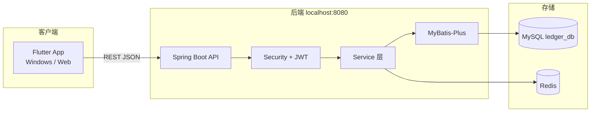

# 小账本 — 系统架构

## 概述

个人记账学习项目：Flutter（Windows/Web）+ Spring Boot + MySQL + Redis。

## 架构图



## 模块划分

| 模块 | 包路径示例 | 职责 |
|------|------------|------|
| login | `controller.login` | 注册、登录、退出 |
| user | `controller.user` | 当前用户信息 |
| category | `controller.category` | 系统预设 + 用户自定义分类 |
| bill | `controller.bill` | 账单 CRUD、分页筛选 |
| stats | `controller.stats` | 本月收入/支出/结余（Redis 缓存） |

## 认证流程

1. 登录成功：签发 JWT（1 天）→ 写入 Redis `auth:token:{userId}`
2. 请求鉴权：校验 JWT 签名与过期 → 检查 Redis 中 Token 是否存在
3. 退出：删除 Redis 中对应 key

## 统计缓存

- Key：`stats:user:{userId}:month:{yyyy-MM}`
- 值：JSON `{ "income", "expense", "balance" }`
- TTL：5 分钟
- 账单变更时主动删除当月 key

## 统一响应

```json
{
  "code": 200,
  "message": "success",
  "data": {}
}
```

## 相关文档

- [开发环境](dev-setup.md)
- [编码规范](conventions.md)
- [数据库](database/schema.sql)
- [接口文档](api/)
