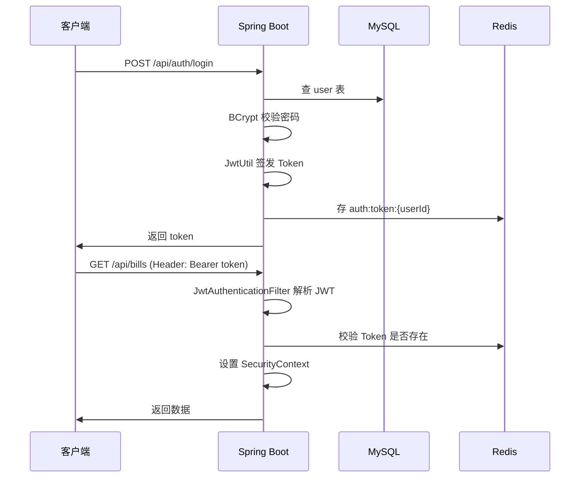

# 04 - 登录与 JWT

## 整体流程



## 注册：密码如何存储

**绝不存明文**。使用 BCrypt：

```java
user.setPassword(passwordEncoder.encode(dto.getPassword()));
```

- 同一密码每次 `encode` 结果不同（内置盐）
- 登录用 `passwordEncoder.matches(明文, 哈希)` 验证

源码：`service/impl/login/AuthServiceImpl.register()`

## 登录：JWT 里有什么

`JwtUtil.generateToken()` 生成字符串，Payload 包含：

- `sub`：userId
- `username`：用户名
- `exp`：过期时间（1 天）

配置：`application.yml` → `jwt.expiration-ms: 86400000`

## 鉴权：JwtAuthenticationFilter

每个请求在到达 Controller **之前**经过过滤器：

1. 读 Header `Authorization: Bearer xxx`
2. `JwtUtil.parseToken()` 验签、解析
3. `AuthRedisService.isTokenValid()` 查 Redis
4. 通过则把 userId 放进 `SecurityContextHolder`

Controller 里用 `SecurityUtils.getUserId()` 取当前用户。

## Spring Security 配置

`config/SecurityConfig.java`：

- `PUBLIC_PATHS`：注册、登录、健康检查 **不需要** Token
- `anyRequest().authenticated()`：其它接口必须已登录
- 未登录访问受保护接口 → 返回 `{ "code": 401 }`

## 退出登录

```java
authRedisService.removeToken(userId);
```

只删 Redis，不删 JWT 字符串本身——但下次请求时 Redis 校验失败，等同失效。

## 关键类对照表

| 类 | 作用 |
|----|------|
| AuthController | 暴露 /api/auth/* 接口 |
| AuthServiceImpl | 注册/登录/退出业务 |
| JwtUtil | 签发、解析 JWT |
| JwtAuthenticationFilter | 请求级鉴权 |
| SecurityConfig | 哪些路径要登录 |
| SecurityUtils | 在 Service/Controller 取当前 userId |

## 练习

1. 登录后复制 token，访问 `GET /api/user/profile` 带 Header
2. 调用 `POST /api/auth/logout` 后再访问 profile，应得 401
3. 用 [jwt.io](https://jwt.io) 解码 token（仅学习，勿泄露真实环境密钥）
