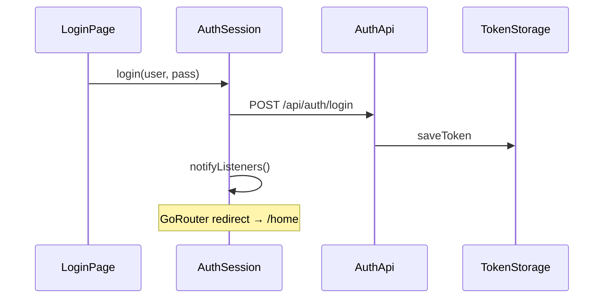

# 09 - Flutter 登录与路由守卫

## 流程



## 核心类

| 类 | 职责 |
|----|------|
| `AuthApi` | 对接 docs/api/auth.md |
| `AuthSession` | Token + 用户信息，ChangeNotifier |
| `TokenStorage` | shared_preferences 持久化 |
| `AppRouter.redirect` | 未登录踢回 /login |

## 路由守卫

```dart
redirect: (context, state) {
  if (!loggedIn && !isAuthPage) return AppRoutes.login;
  if (loggedIn && isAuthPage) return AppRoutes.home;
  return null;
},
refreshListenable: authSession,  // 登录态变化时重新 redirect
```

## 退出

顶栏「退出」→ `AuthSession.logout()` → 清 Token → 跳转 `/login`

## 源码位置

- `features/auth/data/auth_api.dart`
- `features/auth/application/auth_session.dart`
- `app/router/app_router.dart`

## 练习

1. 用 testuser 登录，刷新浏览器是否保持登录（Token 恢复）
2. 点击退出后再访问 /home 是否跳回登录
3. 故意输错密码，看错误提示

## 测试

| 文件 | 说明 |
|------|------|
| `test/widget_test.dart` | UI：登录页表单（Mock SharedPreferences） |
| `test/auth_integration_test.dart` | 真实 HTTP 登录（需 backend + testuser） |
| `test/test_helpers.dart` | Widget 测试与集成测试分别初始化（避免 HTTP 被拦截） |
