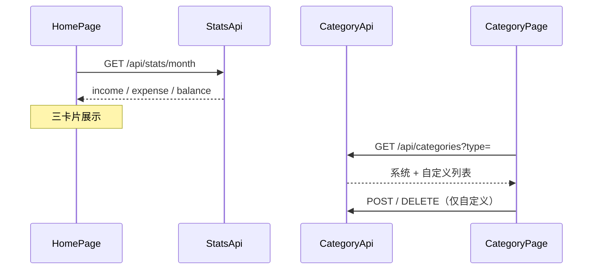

# 10 - Flutter 统计与分类

## 流程

## 核心类

| 类 | 职责 |
|----|------|
| `StatsApi` | 月度汇总，见 docs/api/stats.md |
| `CategoryApi` | 分类 CRUD（列表/新增/删除） |
| `MonthStats` | 统计 Model |
| `CategoryItem` | 分类 Model |
| `StatsCard` | 首页统计卡片 Widget |

## 页面

| 路由 | 页面 | 功能 |
|------|------|------|
| `/home` | HomePage | 本月收入/支出/结余三卡片 |
| `/categories` | CategoryPage | 筛选、列表、新增、删除自定义 |

## 网络层扩展

阶段 3 新增 `DioClient.delete()`，用于 `DELETE /api/categories/{id}`。

## 源码位置

- `features/stats/data/`
- `features/category/data/` + `presentation/category_page.dart`
- `features/home/presentation/home_page.dart`

## 练习

1. 登录后首页是否显示当月统计（无账单时可能全为 0.00）
2. 分类页切换「收入/支出」筛选是否正确
3. 新增自定义分类后列表是否刷新；系统分类是否无法删除

## 测试

| 文件 | 说明 |
|------|------|
| `test/stats_category_integration_test.dart` | 真实 HTTP（需 backend + testuser） |
