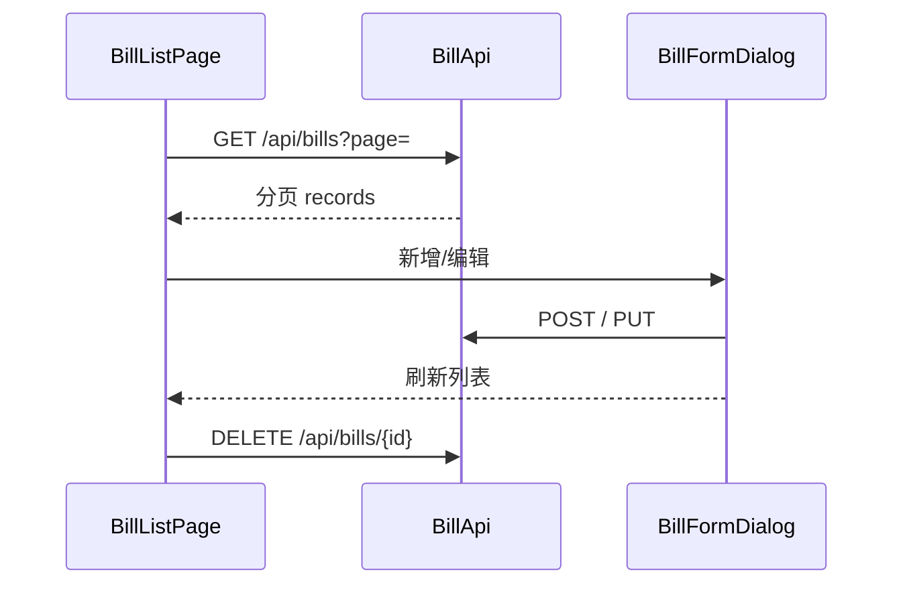

# 11 - Flutter 账单 CRUD

## 流程

## 核心类

| 类 | 职责 |
|----|------|
| `BillApi` | 分页、增删改，见 docs/api/bill.md |
| `BillItem` | 单条账单 Model |
| `BillPage` | 分页结果 Model（data 层） |
| `BillListPage` | 列表 + 筛选 + 分页 |
| `showBillFormDialog` | 新增/编辑对话框 |

## 网络层

阶段 4 新增 `DioClient.put()`，用于 `PUT /api/bills/{id}`。

## 页面

| 路由 | 功能 |
|------|------|
| `/bills` | DataTable 列表、类型筛选、分页、增删改 |

表单内根据「收入/支出」动态加载对应分类下拉框。

## 源码位置

- `features/bill/data/`
- `features/bill/presentation/bill_list_page.dart`
- `features/bill/presentation/widgets/bill_form_dialog.dart`

## 练习

1. 新增一笔支出，首页统计是否变化（需刷新首页）
2. 编辑账单金额，列表与统计是否更新
3. 删除账单后分页是否正确

## 测试

| 文件 | 说明 |
|------|------|
| `test/bill_integration_test.dart` | 分页 + 创建删除（需 backend） |
