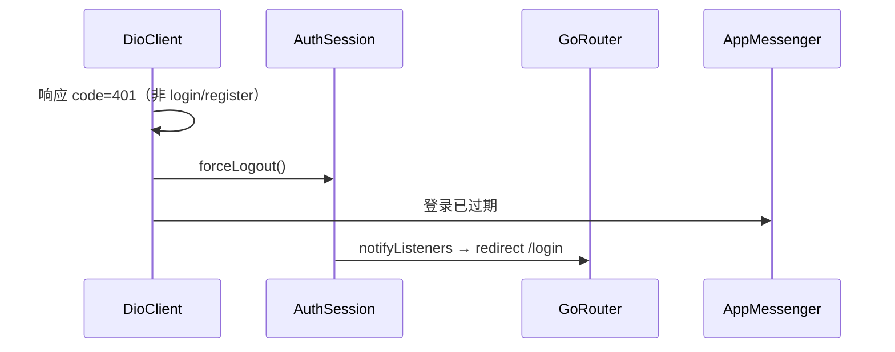

# 12 - Flutter 交互与体验优化

## 阶段 5 目标

在不引入 TDesign 的前提下，用 **Material 3 + 公共组件** 统一反馈与加载态，并完善 401 处理。

> TDesign 为可选项，本项目 MVP 保持零额外 UI 依赖，见 [08-flutter-ui.md](08-flutter-ui.md)。

## 公共组件

| 组件 | 路径 | 用途 |
|------|------|------|
| `AppMessenger` | `core/feedback/app_messenger.dart` | 全局 SnackBar：成功/错误/提示 |
| `AsyncStateView` | `core/widgets/async_state_view.dart` | loading / error / empty / content |
| `PageHeader` | `core/widgets/page_header.dart` | 页面标题 + 操作区 |
| `showConfirmDialog` | `core/widgets/confirm_dialog.dart` | 删除等二次确认 |
| `InlineErrorBanner` | `core/widgets/inline_error_banner.dart` | 登录/注册表单错误 |

## 401 自动登出



实现：`DioClient` 响应拦截 + `AuthSession.forceLogout()`。

## 使用示例

```dart
// 成功/失败反馈
AppMessenger.showSuccess('已保存');
AppMessenger.showError(result.message);

// 列表页异步态
AsyncStateView(
  loading: _loading && _items.isEmpty,
  error: _error,
  onRetry: _load,
  isEmpty: _items.isEmpty,
  child: ListView(...),
);
```

## 注册方式

`MaterialApp.router` 需设置：

```dart
scaffoldMessengerKey: AppMessenger.messengerKey,
```

## 练习

1. 登录后手动改 localStorage 中的 Token，刷新页面是否跳回登录
2. 删除账单时确认框样式是否统一
3. 首页无账单时是否显示引导提示

## 测试

| 文件 | 说明 |
|------|------|
| `test/async_state_view_test.dart` | AsyncStateView 三种状态 |
